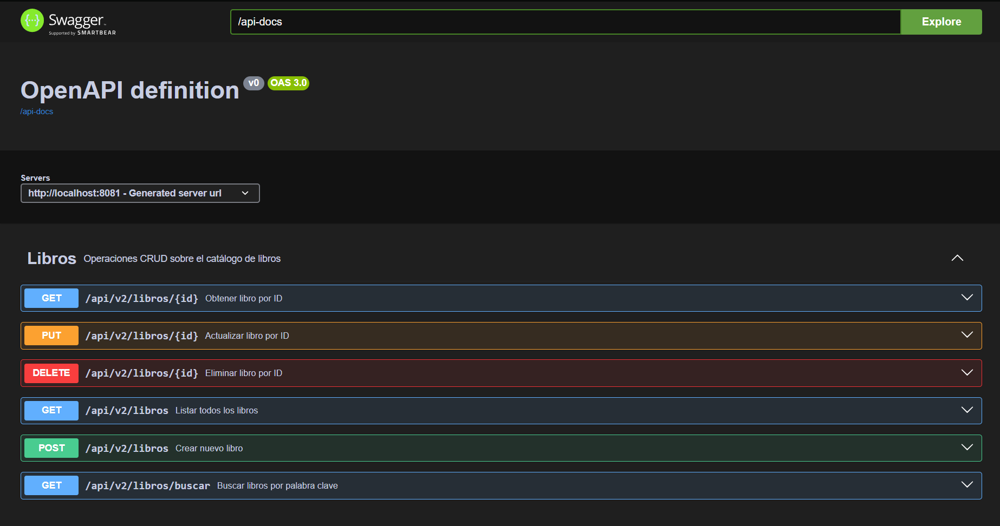
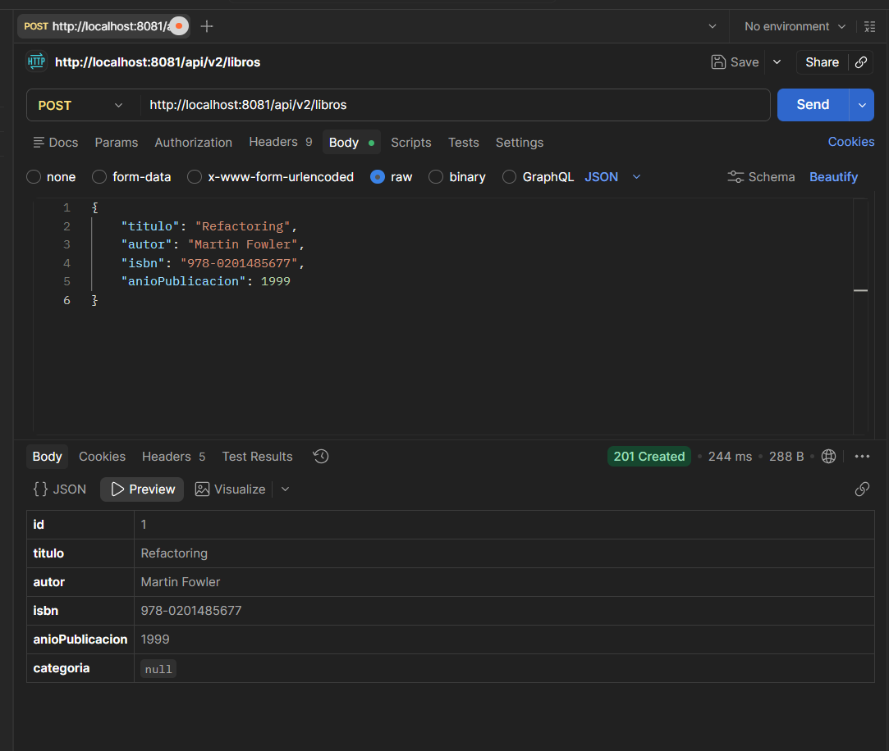

# Biblioteca API v2 - Arquitectura Profesional con DTOs y Swagger

Este repositorio contiene la segunda versión de la API RESTful para la gestión de una biblioteca, desarrollada como parte del laboratorio "Post-Contenido 2" de la Unidad 5.

En esta iteración, la aplicación evolucionó para incluir prácticas profesionales de desarrollo backend:
* **Patrón DTO (Data Transfer Object) y Mapper:** Para aislar el modelo de base de datos (Entidad) de los datos que se exponen o reciben del cliente.
* **Manejo Global de Errores:** Implementación de `@RestControllerAdvice` para capturar excepciones y devolver respuestas HTTP semánticamente correctas (400, 404) con mensajes amigables en formato JSON.
* **Documentación Interactiva:** Integración con SpringDoc OpenAPI (Swagger) para probar y visualizar los endpoints desde el navegador.

## Tecnologías Utilizadas
* Java / Spring Boot 3.2.11
* Spring Web & Spring Data JPA
* H2 Database (En memoria)
* Spring Boot Validation
* SpringDoc OpenAPI (Swagger UI)
* Lombok

## Instrucciones de Ejecución
1. Clonar el repositorio.
2. Ejecutar la clase principal `BibliotecaApiApplication.java` o usar el comando Maven: `./mvnw spring-boot:run`.
3. La documentación de **Swagger UI** estará disponible en: `http://localhost:8081/swagger-ui.html`
4. Los endpoints de la API responden en la ruta base: `/api/v2/libros`

---

## Evidencias de Funcionamiento

A continuación se presentan las capturas de pantalla solicitadas en la rúbrica del laboratorio, demostrando la documentación y el correcto funcionamiento del manejador global de errores:

### 1. Documentación Interactiva (Swagger UI)

### 2. Creación Exitosa (POST - 201 Created)

### 3. Error de Validación de Datos (400 Bad Request)
*Se intentó enviar un libro con campos vacíos o inválidos, activando las validaciones `@NotBlank` y `@Min`.*

### 4. Error por ISBN Duplicado (400 Bad Request)
*Se intentó registrar un libro con un ISBN que ya existe en la base de datos.*

### 5. Error Libro No Encontrado (404 Not Found)
*Se solicitó un ID de libro que no existe en la base de datos.*
